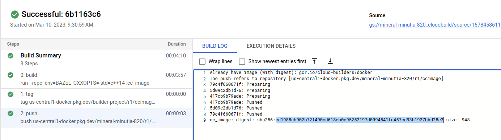

## Deterministic container images with c++ and GCP APIs using [bazel](https://bazel.build/).


The following sample will build a simple container that uses GCP KMS apis.  

These images are will have a consistent image hash no matter where it is built

*  `ccimage@sha256:cd1988cb902b72f490cd618eb0c95252197d0094841fe457cd93b1927bbd28e2`



For reference, see:

- [Building deterministic Docker images with Bazel](https://blog.bazel.build/2015/07/28/docker_build.html)
- [Create Container images with Bazel](https://dev.to/schoren/create-container-images-with-bazel-47am)
- [rules_docker](https://github.com/bazelbuild/rules_docker)
* [Deterministic builds with go + bazel + grpc + docker](https://github.com/salrashid123/go-grpc-bazel-docker)
* [Deterministic builds with nodejs + bazel + docker](https://github.com/salrashid123/nodejs-bazel-docker)


To run this sample, you will need `bazel` installed (see [Cloud Shell](#cloud-shell) for an easy way to use `bazel`)

In the end, you'll end up with the same digests


```bash
export PROJECT_ID=`gcloud config get-value core/project`
export PROJECT_NUMBER=`gcloud projects describe $PROJECT_ID --format='value(projectNumber)'`
export GCLOUD_USER=`gcloud config get-value core/account`

gcloud kms keyrings create kr1 --location=us-central1
gcloud kms keys create --keyring=kr1 --location=us-central1 --purpose=encryption  key1

gcloud kms keys add-iam-policy-binding key1 \
    --keyring=kr1 --location=us-central1 \
    --member=user:$GCLOUD_USER \
    --role=roles/cloudkms.cryptoKeyEncrypterDecrypter
```


```bash
$ bazel version
Build label: 5.3.1
Build target: bazel-out/k8-opt/bin/src/main/java/com/google/devtools/build/lib/bazel/BazelServer_deploy.jar
Build time: Mon Sep 19 17:28:49 2022 (1663608529)
Build timestamp: 1663608529
Build timestamp as int: 1663608529
```

```bash
bazel run --repo_env=BAZEL_CXXOPTS=-std=c++14  :main -- "projects/$PROJECT_ID/locations/us-central1/keyRings/kr1/cryptoKeys/key1"
bazel run --repo_env=BAZEL_CXXOPTS=-std=c++14  :cc_image

# gcloud auth application-default login
# docker run -ti -v $HOME/.config/gcloud:/root/.config/gcloud gcr.io/google.com/cloudsdktool/google-cloud-cli gcloud auth application-default print-access-token

docker run -t \
  -v $HOME/.config/gcloud:/root/.config/gcloud \
  us-central1-docker.pkg.dev/builder-project/repo1/ccimage:cc_image "projects/$PROJECT_ID/locations/us-central1/keyRings/kr1/cryptoKeys/key1"
```


To deploy on cloud platform

```bash
gcloud artifacts repositories create r1 --repository-format=docker --location=us-central1 
gcloud artifacts repositories add-iam-policy-binding r1 \
    --location=us-central1  \
    --member=serviceAccount:$PROJECT_NUMBER@cloudbuild.gserviceaccount.com \
    --role=roles/artifactregistry.writer

gcloud builds submit .
```

